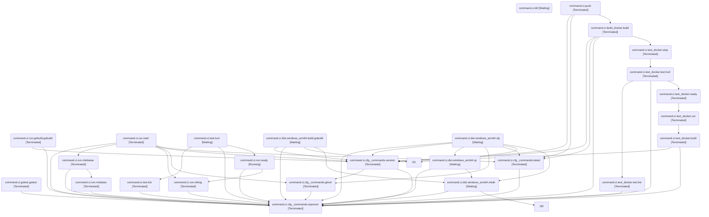

```mermaid
graph TD
  t0("command.ci.gotest.gotest [Terminated]")
  t0-->t44
  t1("command.ci.run.gobuild.gobuild [Terminated]")
  t1-->t45
  t1-->t44
  t2("command.ci.run.rmdataw [Terminated]")
  t2-->t44
  t3("command.ci.run.mkdataw [Terminated]")
  t3-->t44
  t3-->t2
  t4("command.ci.run.mklog [Terminated]")
  t4-->t44
  t5("command.ci.run.ready [Running]")
  t5-->t44
  t5-->t4
  t6("command.ci.run.start [Terminated]")
  t6-->t44
  t6-->t3
  t6-->t4
  t6-->t46
  t6-->t45
  t6-->t47
  t7("command.ci.test.list [Terminated]")
  t7-->t44
  t8("command.ci.test.hurl [Waiting]")
  t8-->t7
  t8-->t44
  t8-->t5
  t9("command.ci.kill [Waiting]")
  t32("command.ci.dist.windows_arm64.mkdir [Waiting]")
  t32-->t44
  t32-->t30
  t33("command.ci.dist.windows_arm64.build.gobuild [Waiting]")
  t33-->t45
  t33-->t44
  t33-->t31
  t33-->t32
  t34("command.ci.dist.windows_arm64.cp [Waiting]")
  t34-->t44
  t34-->t32
  t35("command.ci.dist.windows_arm64.zip [Waiting]")
  t35-->t44
  t35-->t45
  t35-->t34
  t35-->t46
  t35-->t47
  t35-->t31
  t35-->t32
  t36("command.ci.test_docker.build [Terminated]")
  t36-->t45
  t36-->t44
  t37("command.ci.test_docker.run [Terminated]")
  t37-->t36
  t38("command.ci.test_docker.ready [Terminated]")
  t38-->t37
  t39("command.ci.test_docker.test.list [Terminated]")
  t39-->t44
  t40("command.ci.test_docker.test.hurl [Terminated]")
  t40-->t39
  t40-->t44
  t40-->t38
  t41("command.ci.test_docker.stop [Terminated]")
  t41-->t40
  t42("command.ci.build_docker.build [Terminated]")
  t42-->t45
  t42-->t47
  t42-->t44
  t42-->t41
  t43("command.ci.push [Terminated]")
  t43-->t45
  t43-->t47
  t43-->t42
  t44("command.ci.cfg._commands.reporoot [Terminated]")
  t45("command.ci.cfg._commands.version [Terminated]")
  t45-->t46
  t45-->t44
  t46("command.ci.cfg._commands.gitver [Terminated]")
  t46-->t44
  t47("command.ci.cfg._commands.latest [Terminated]")
  t47-->t44
```
