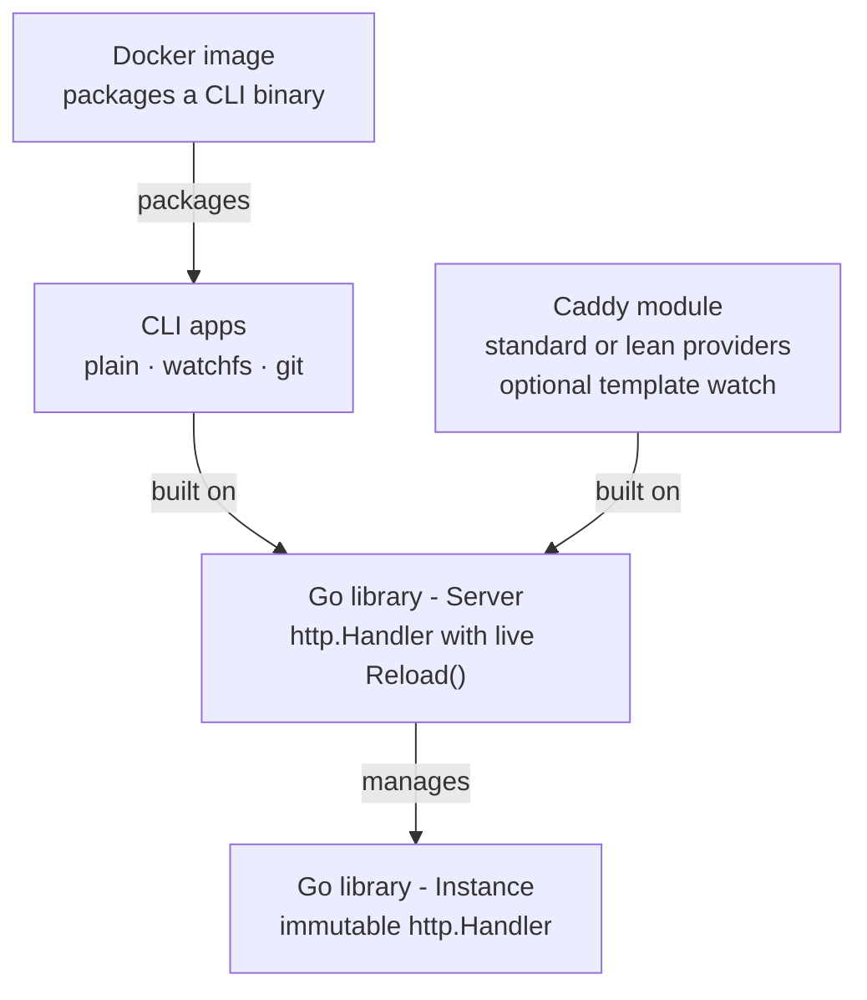

# Deployment modes

xtemplate can plug into a stack at several layers. Higher modes package the ones below them; pick the layer that matches how much of the stack you want owned for you.



## Which layer to use

| If you want… | Use |
|---|---|
| Zero setup, just bring your templates | Docker image |
| Local dir, no auto-reload | CLI plain (`./cmd`) |
| Local dir, reload on file change | CLI watchfs (`./cmd/watchfs`) - default for dev |
| Templates from a Git remote, poll and reload | CLI git (`./cmd/git`) |
| Caddy's ecosystem (automatic HTTPS, auth, proxy, etc.) | Caddy module |
| A reloadable handler embedded in your own Go app | Go: Server |
| Maximum control, no reload machinery | Go: Instance |

## Docker

Published images are `infogulch/xtemplate` on [Docker Hub](https://hub.docker.com/r/infogulch/xtemplate). Tags: version tags (e.g. `v0.9.6`) and `latest` on release.

The image runs the plain CLI binary (no filesystem watch), listens on port 80 by default, and expects a templates directory at `/app/templates` (the process working directory is `/app`).

```shell
# Serve ./templates from the host on http://localhost:8080
docker run --rm -p 8080:80 \
  -v "$PWD/templates:/app/templates:ro" \
  infogulch/xtemplate:latest
```

With a config file and optional data mounts:

```shell
docker run --rm -p 8080:80 \
  -v "$PWD/templates:/app/templates:ro" \
  -v "$PWD/config.json:/app/config.json:ro" \
  -v "$PWD/data:/app/data" \
  infogulch/xtemplate:latest \
  --config-file /app/config.json
```

Build the image locally from the repo root:

```shell
mise run build-docker
# or: docker build -t infogulch/xtemplate:local .
```

See also [CLI reference](cli.md) and [Configuration](configuration.md).

## CLI apps

There are three thin `main` packages. They share most flags, JSON config, and providers; they differ only in where templates come from and how reloads are triggered. All sit on `xtemplate.Server`.

| Variant | Package | Entry | Template source | Reload |
|---|---|---|---|---|
| plain | `app` | [`cmd`](../../cmd) | Local `templates_dir` | None (restart to pick up changes) |
| watchfs | `app/watchfs` | [`cmd/watchfs`](../../cmd/watchfs) | Local `templates_dir` | Filesystem watch on templates dir (+ `--watch` extras) |
| git | `app/git` | [`cmd/git`](../../cmd/git) | Git remote (`--git-repo`) | Poll remote; shallow-clone on new commit |

### Install

Binary names depend on how you obtain the CLI:

| Source | Binary name | Build |
|---|---|---|
| [GitHub release](https://github.com/infogulch/xtemplate/releases) archives | `xtemplate` | `./cmd/watchfs` |
| `go install …/cmd/watchfs` | `watchfs` | last path segment |
| `go build -o xtemplate ./cmd/watchfs` | whatever you pass to `-o` | local checkout |

```shell
# Release asset
# unzip xtemplate-*_*.zip && sudo mv xtemplate /usr/local/bin/

go install github.com/infogulch/xtemplate/cmd/watchfs@latest
# → $GOBIN/watchfs

# From a checkout
go build -o xtemplate ./cmd/watchfs   # watchfs (recommended)
go build -o xtemplate ./cmd           # plain (no reload)
go build -o xtemplate-git ./cmd/git   # git-backed
```

For a containerized plain CLI, see [Docker](#docker). Custom drivers, embed, or providers: [Custom build](../how-to/custom-build.md).

Shared flags and extending the CLI: [CLI reference](cli.md). Field catalog and JSON: [Configuration](configuration.md).

### Plain (`cmd`)

Serve a local template tree; no automatic reload.

```shell
./xtemplate --templates-dir templates --listen :8080
```

Used by the Docker image. Prefer watchfs for day-to-day editing.

### watchfs (`cmd/watchfs`)

Default developer CLI and the binary shipped in GitHub release archives (as `xtemplate`). Always watches the templates directory and reloads the server when files change. A failed load keeps the previous instance and logs the error.

`go install` produces a binary named `watchfs`; local and release builds usually rename it to `xtemplate` with `-o`.

```shell
./xtemplate --listen :8080
# also watch a data directory (templates root is always watched)
./xtemplate --watch data --listen :8080
```

### git (`cmd/git`)

Serve templates from a Git repository. The process shells out to the system `git` binary (no go-git dependency): it `ls-remote`s on an interval, shallow-clones when the ref moves, and reloads via `WithTemplateFS`. The server starts with an empty FS and begins serving real routes after the first successful clone.

Requires `--git-repo` (or `git_repo` in JSON).

| Flag / JSON | Default | Meaning |
|---|---|---|
| `--git-repo` / `git_repo` | (required) | Remote URL (or path git accepts) |
| `--git-ref` / `git_ref` | (git default) | Branch, tag, or commit-ish |
| `--git-interval` / `git_interval` | `15s` | How often to poll for a new commit |

`templates_dir` is resolved inside the clone (default `templates`).

```shell
go build -o xtemplate-git ./cmd/git
./xtemplate-git \
  --git-repo https://github.com/example/my-site.git \
  --git-ref main \
  --git-interval 30s \
  --listen :8080
```

```json
{
  "git_repo": "https://github.com/example/my-site.git",
  "git_ref": "main",
  "git_interval": "30s",
  "templates_dir": "templates",
  "listen": "0.0.0.0:8080"
}
```

Needs `git` on `PATH`. Failures to fetch or clone are logged and retried; the last good instance keeps serving. Recent clones are retained briefly so in-flight requests can finish after a swap.

Library entry: [`git.Main`](https://pkg.go.dev/github.com/infogulch/xtemplate/app/git).

## Caddy module

The `xtemplate/caddy` plugin integrates xtemplate into [Caddy](https://caddyserver.com) as HTTP middleware (`http.handlers.xtemplate`), so you can layer automatic HTTPS, auth, reverse proxy, and the rest of the Caddy ecosystem around your templates.

### Build variants

| Build | xcaddy / download | Includes |
|---|---|---|
| standard | `--with github.com/infogulch/xtemplate/caddy/standard` | Handler + Caddyfile for sql/fs/flags/nats + pure-Go sqlite3 driver |
| lean | `--with …/caddy` plus selected `providers/dot*/caddyfile` | Only the providers you list |

Download a prebuilt Caddy with the standard set:

- [Caddy download with xtemplate standard](https://caddyserver.com/download?package=github.com%2Finfogulch%2Fxtemplate%2Fcaddy%2Fstandard)

Or build:

```shell
# Full standard set
xcaddy build \
  --with github.com/infogulch/xtemplate/caddy/standard

# Leaner: core module + chosen provider Caddyfile packages (+ driver if using sql)
xcaddy build \
  --with github.com/infogulch/xtemplate/caddy \
  --with github.com/infogulch/xtemplate/providers/dotsql/caddyfile \
  --with github.com/ncruces/go-sqlite3/driver
```

### Config and live reload

Minimal Caddyfile:

```Caddyfile
:8080

route {
	xtemplate
}
```

That loads templates from `./templates` by default. Optional blocks:

```Caddyfile
:8080

route {
	xtemplate {
		templates_dir templates
		minify true
		precompress gzip br
		# Reload when files under templates_dir change (default true)
		watch_template_path true

		provider sql DB {
			driver  sqlite3
			connstr file:./app.sqlite
		}
	}
}
```

`watch_template_path` (default `true`) is the Caddy analogue of the watchfs CLI. Set it `false` for production trees that will not be edited in place (deploy by replacing the tree and reloading Caddy, or rebuild). There is no built-in Caddy git poller; use the git CLI app, an external sync into `templates_dir`, or your own reload trigger.

See [`caddy/README.md`](../../caddy/README.md) for the full Caddyfile surface and [Configuration](configuration.md) for JSON.

## Go library

[](https://pkg.go.dev/github.com/infogulch/xtemplate)

Public API starts with [`xtemplate.Config`](https://pkg.go.dev/github.com/infogulch/xtemplate#Config). From a config you build either an Instance or a Server.

### Instance

An `Instance` is an immutable `http.Handler`: templates and static files are loaded once, routes are fixed, and the handler never mutates after build.

Use an Instance when you do not need reload, or when you want to mount individual routes into your own mux.

```go
cfg := xtemplate.New()
// cfg.TemplatesDir = "templates"  // default
inst, _, routes, err := cfg.Instance()
if err != nil {
	log.Fatal(err)
}
// inst is an http.Handler for the whole instance; routes lists each pattern
// if you want to mount pieces into your own mux.
_ = routes
http.ListenAndServe(":8080", inst)
```

### Server

A `Server` implements `http.Handler` and holds the current Instance, replacing it atomically via `Reload()`. In-flight requests finish on the old instance; new requests use the new one.

`Reload(opts...)` options apply only to that rebuild (a copy of the base config). They are **not sticky**: the next reload starts from the original config again unless you change the base config. Channel-driven reloads (e.g. git’s `WithTemplateFS`) must resend any options every time.

Use a Server for live reload (filesystem watch, git poll, Caddy reconfig, or your own signal).

```go
cfg := xtemplate.New()
srv, err := cfg.Server()
if err != nil {
	log.Fatal(err)
}
// later: srv.Reload()
http.ListenAndServe(":8080", srv)
// or: srv.Serve(":8080")
```

### App helpers

CLI-shaped programs that parse flags and JSON:

| Call | Same behavior as |
|---|---|
| [`app.Main`](https://pkg.go.dev/github.com/infogulch/xtemplate/app#Main) | plain CLI |
| [`watchfs.Main`](https://pkg.go.dev/github.com/infogulch/xtemplate/app/watchfs) | watchfs CLI |
| [`git.Main`](https://pkg.go.dev/github.com/infogulch/xtemplate/app/git) | git CLI |

Pass `xtemplate.Option` overrides into any of them - see [Custom build](../how-to/custom-build.md) and the [`examples/`](../../examples/) tree.
